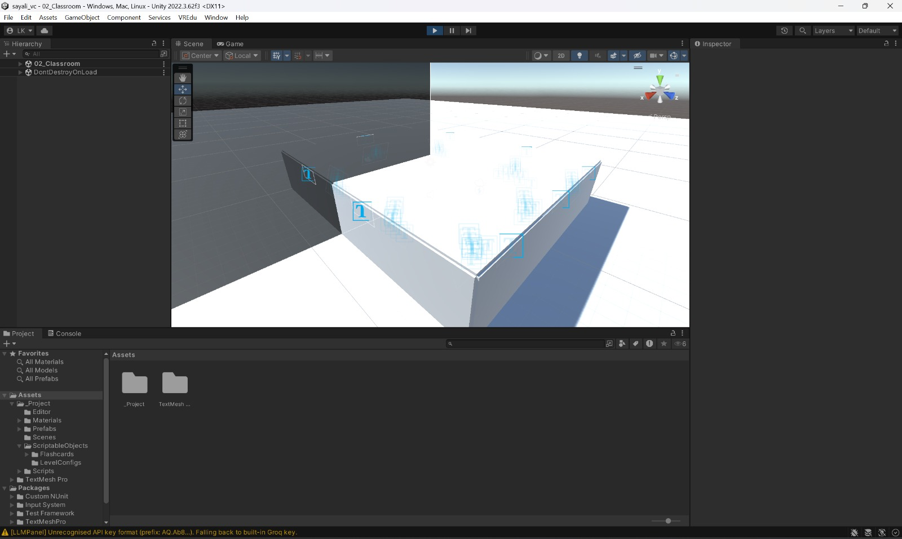
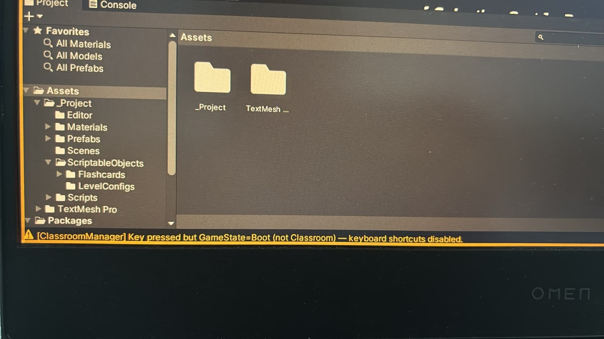
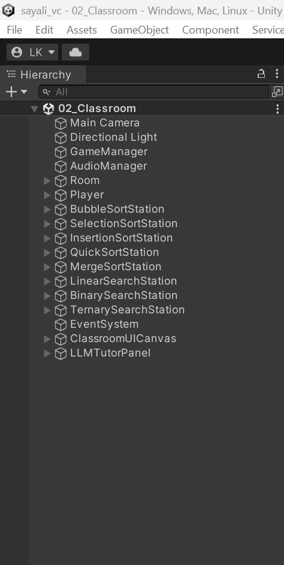
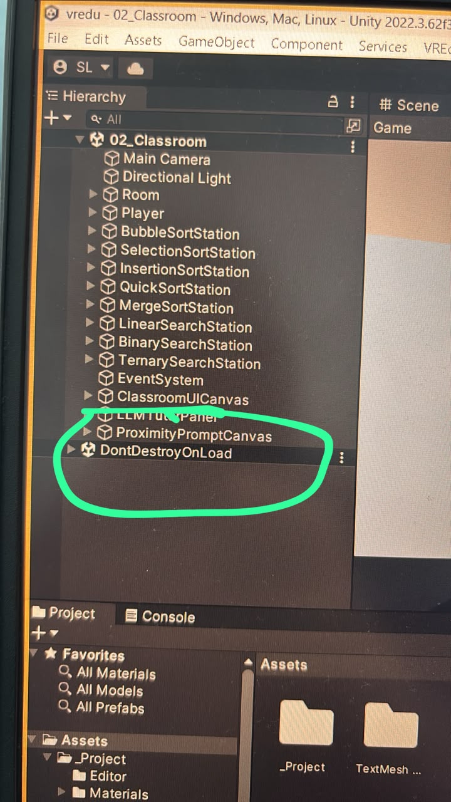
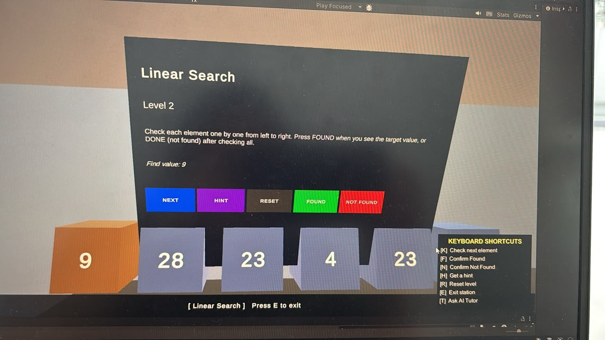

1. Purpose
This document records the final significant issue identified during testing, the troubleshooting attempts used to investigate it, the solution that resolved the problem, and the resulting completion of the Capstone_VREdu project.

The issue concerned the optional LLM tutor, the logout and login flow, and the behaviour of the Escape key. It was documented through practical communication, screenshots, Unity editor evidence, and repeated testing of updated project archives.

2. Final Issue Identified
The final issue was that the LLM tutor was not responding when the user pressed the tutor shortcut. At the same time, pressing Escape did not consistently produce the expected pause or summary behaviour. In some runs, the application appeared to move towards logout or summary-related behaviour unexpectedly, while the tutor panel remained inactive.

A further related issue was that logout and subsequent login were also reported as unreliable. This meant that the problem was not limited to the tutor request itself; it affected the interaction between classroom controls, summary controls, authentication flow, and the shared keyboard input system.

The observed symptoms were therefore:

The tutor panel did not respond when the tutor key was pressed.

Pressing Escape did not consistently show the expected screen.

Logout and login did not always work correctly.

The Unity console displayed a warning indicating that a classroom shortcut was being processed while the game state was not the classroom state.

The project contained persistent objects and multiple scene-level controllers that could respond to the same keyboard events.

3. Initial Troubleshooting Attempts
The issue was investigated through a sequence of trial-and-error steps rather than through a single immediate fix.

3.1 Testing the tutor shortcut
The tutor shortcut was pressed while the user was in the classroom window. No tutor response appeared, which suggested that the input was either not reaching the tutor controller or was being intercepted by another component.

The tutor functionality was tested again after importing an updated project archive. The result remained unsuccessful, so the problem was not treated as a simple import failure.

*Figure 5. Unity warning concerning the recognised format of the configured LLM API key.*

A separate console warning also indicated that the configured LLM API key format was not recognised and that the system was falling back to a built-in key. This was recorded as an additional configuration observation. It was considered separately from the controller-input conflict because it concerned external tutor-service configuration rather than the routing of keyboard input.

3.2 Re-importing the project
A new project archive was supplied and the previous extracted folder was removed before importing the replacement version. This was intended to eliminate stale files, outdated scripts, duplicated objects, or cached configuration from the earlier project state.

After the replacement project was imported, the tutor was tested again. Although the project structure appeared cleaner, the tutor still did not respond consistently.

3.3 Investigating the Unity console
The Unity console displayed a message indicating that a classroom-related key event had been received while the current game state was Boot rather than Classroom. This was an important diagnostic clue because it showed that keyboard input was reaching a controller at the wrong time in the application lifecycle.

The warning suggested that the problem was related to state management and input ownership rather than only to the visual tutor panel.

The warning confirmed that a classroom keyboard event was being received while the application was in the `Boot` state rather than the expected `Classroom` state. This was treated as evidence of incorrect input routing or competing controller dependencies.

*Figure 4. Unity console warning showing classroom input received while the game state was Boot.*

3.4 Checking persistent objects
The Unity hierarchy was inspected and a DontDestroyOnLoad object was observed in the classroom scene. The project architecture uses persistent managers to preserve session and application state between scenes, but persistent controllers can create conflicts if more than one instance exists or if a controller continues to receive input after its scene is no longer active.

This inspection supported the possibility that input handling was being duplicated or that keyboard events were being processed by controllers belonging to different scenes.

3.5 Repeating logout and login tests
Logout and login were tested separately from the tutor shortcut. These tests showed that the authentication flow could also be affected by the same input and scene-management problem. The issue therefore appeared to involve shared key dependencies rather than an isolated failure in the LLM service.

4. Root Cause
The final diagnosis was that the classroom and summary controllers were overlapping in their handling of keyboard input. In particular, both controllers had dependencies associated with the T and Escape keys. This created ambiguity over which controller should respond when those keys were pressed.

The Unity hierarchy was inspected during troubleshooting to identify the active classroom managers, algorithm stations, UI objects, and tutor-related components. This review was necessary to establish whether more than one controller could be responding to shared keyboard events.

*Figure 2. Classroom hierarchy inspected during the final input-conflict investigation.*

The investigation also identified a `DontDestroyOnLoad` object. Because persistent objects can continue across scene transitions, this object was considered when checking whether controllers or input handlers were surviving beyond their intended scene state.

*Figure 3. Persistent `DontDestroyOnLoad` object observed while investigating scene and input state.*

The conflict caused keyboard events to be processed in an incorrect application state. As a result:

the tutor shortcut was not reliably routed to the tutor panel,

the Escape key could trigger the wrong state transition,

logout and summary behaviour became inconsistent,

and the console reported classroom input while the application was still in a boot or non-classroom state.

This explains why repeated imports alone did not resolve the problem. The project could be imported successfully while still containing an input dependency conflict between scene controllers.

5. Implemented Solution
The solution was to remove the conflicting dependency from the relevant controller configuration so that the classroom and summary controllers no longer competed for the same keyboard events.

The corrective work included:

Identifying the overlapping T and Escape key dependencies.

Removing the unnecessary dependency from the controller that should not respond to those events.

Re-importing or re-running the corrected project version.

Testing the tutor shortcut again from the classroom.

Testing the Escape behaviour separately.

Testing logout and login after the input conflict had been removed.

Closing the temporary quick-assist troubleshooting process after the corrected behaviour was confirmed.

6. Verification After the Fix
After the controller dependency was removed, the tutor began working correctly. The corrected result confirmed that the failure was not caused by the overall LLM design, the classroom scene, or the API configuration alone. Instead, the main cause was the conflicting input dependency between controllers.

The classroom was retested through the Linear Search station after the correction. The station displayed Level 2, the target value, the array elements, the available action controls, and the keyboard-shortcut panel. This demonstrated that the classroom interaction environment remained operational after the final input-dependency correction.

*Figure 1. Linear Search station operating at Level 2 after the final correction.*

The authentication flow was also retested after the fix. Logout and login behaviour was checked again to ensure that the correction did not resolve the tutor while leaving the scene-management problem active.

The final communication confirmed that the project was working after the overlapping controller dependency had been removed. This provided evidence that the last major runtime issue had been resolved.

7. Outcome
The final issue-resolution cycle achieved the following outcomes:

The tutor shortcut became functional.

The conflicting classroom and summary key dependencies were removed.

The incorrect handling of Escape was addressed.

Logout and login were retested after the correction.

The project was re-imported and checked after replacing the previous project version.

The temporary quick-assist troubleshooting activity was closed once the issue was resolved.

This marked the completion of the main project implementation and testing cycle.

8. Final Reflection
The final issue demonstrated the importance of testing keyboard input at the level of the complete application rather than testing each controller in isolation. The tutor service itself appeared to be available, but the feature was unusable because another controller was competing for the same input dependencies.

The issue also demonstrated the importance of checking Unity’s hierarchy, persistent objects, game-state warnings, and scene-specific controllers when a feature appears unresponsive. Re-importing the project was useful for excluding stale files, but the permanent solution required identifying and removing the underlying controller dependency conflict.

9. Project Completion Statement
Following the removal of the overlapping input dependency and the subsequent retesting of the tutor, Escape behaviour, logout, and login, the final recorded runtime issue was resolved. The Capstone_VREdu project was therefore considered complete at the end of this development cycle.

The project documentation now records the complete development journey, including the intended architecture, installation procedure, earlier visual and summary issues, testing observations, final input conflict, corrective actions, and completion status.

10. Final Status
Status: Project completed after final runtime issue resolution.

The project is ready to be presented with its supporting repository documentation, while the recorded issues and solutions remain available as evidence of iterative software engineering practice.
